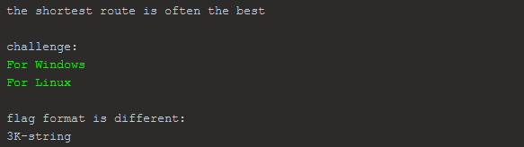
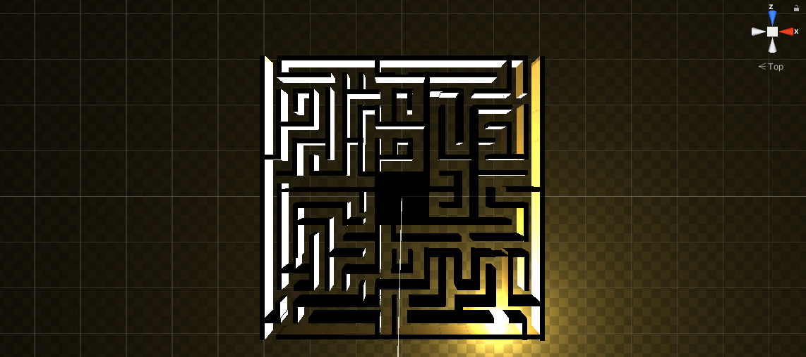
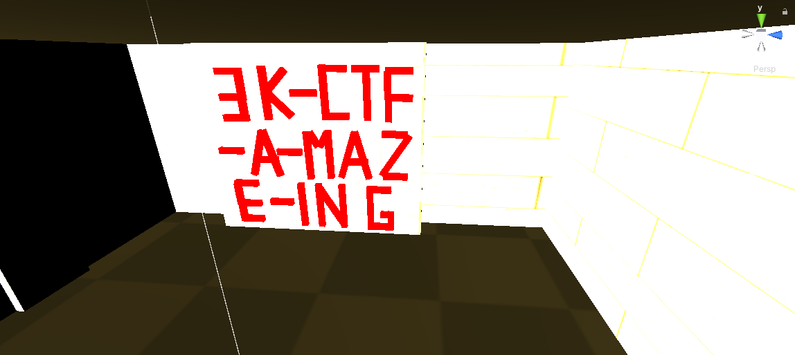
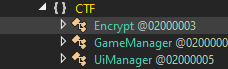
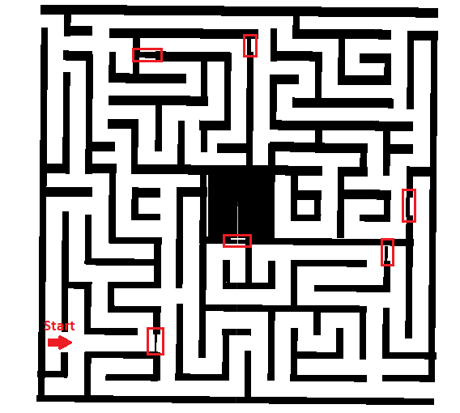
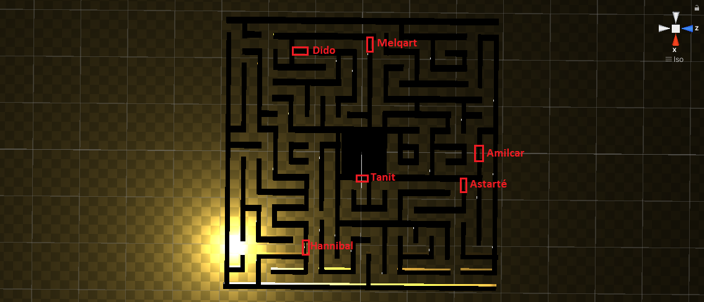

# game

The challenge was reversing a unity game and there were 2 flags hidden in the game. 
From the look of the game it was just a big maze, so I tried importing the level into Unity.
I used [uTinyRipper](https://github.com/mafaca/UtinyRipper) to extract the files from the `CTF_Data/level0` file and imported those into unity.



There was a room in the middle of the maze which contained the first flag:



For the second flag I used [dnSpy](https://github.com/0xd4d/dnSpy) to debug the code. 
The `CTF_Data/Managed/Assembly-CSharp.dll` contained 3 classes:



[Encrypt](Encrypt.cs) contains the encryption and decryption algorithm for the flag, [GameManager](GameManager.cs) a function for detecting collisions and [UiManager](UiManager.cs) a function for updating the text in the top-left of the screen.

```cs
private void OnTriggerEnter(Collider other)
{
  if (other.tag == "Box1")
  {
    if (this.isCollidingBox1)
    {
      return;
    }
    this.isCollidingBox1 = true;
    UiManager.current.UpdateTexte(this.Box1);
    Object.Destroy(other.gameObject);
  }
  [...]
  if (other.tag == "Box6")
  {
    if (this.isCollidingBox6)
    {
      return;
    }
    this.isCollidingBox6 = true;
    UiManager.current.UpdateTexte(this.Box6);
    Object.Destroy(other.gameObject);
  }
}
```
From this part of the [GameManager](GameManager.cs) you can see that there are 6 "special" colliders in the game that trigger an update in the [UiManager](UiManager.cs):
```cs
public void UpdateTexte(string textToAdd)
{
  this.counter++;
  Text text = this.textHolder;
  text.text += textToAdd;
  if (this.counter == 6)
  {
    this.cText = Encrypt.current.DecryptString(this.textHolder.text);
    this.textHolder.text = this.cText;
  }
}
```
After all 6 colliders have been triggered the `DecryptString` function from the [Encrypt](Encrypt.cs) class is called:
```cs
public string DecryptString(string key)
  {
    byte[] array = Convert.FromBase64String(this.cipherText);
    string result;
    using (Aes aes = Aes.Create())
    {
      Rfc2898DeriveBytes rfc2898DeriveBytes = new Rfc2898DeriveBytes(key, new byte[]
      {
        73,
        118,
        97,
        110,
        32,
        77,
        101,
        100,
        118,
        101,
        100,
        101,
        118
      });
      aes.Key = rfc2898DeriveBytes.GetBytes(32);
      aes.IV = rfc2898DeriveBytes.GetBytes(16);
      try
      {
        using (MemoryStream memoryStream = new MemoryStream())
        {
          using (CryptoStream cryptoStream = new CryptoStream(memoryStream, aes.CreateDecryptor(), CryptoStreamMode.Write))
          {
            cryptoStream.Write(array, 0, array.Length);
            cryptoStream.Close();
          }
          this.cipherText = Encoding.Unicode.GetString(memoryStream.ToArray());
        }
        result = this.cipherText;
      }
      catch (Exception)
      {
        result = "wrong Order mate ";
      }
    }
    return result;
}
```
This function attempts to decrypt the `cipherText` but it seems like the Boxes have to be triggered in the right order. 

I was able to extract the special colliders from Unity:



Unfortunately the Tags of the boxes showed up as `unknown_2000X` in Unity so I had to manually go to them in the game and write down the text from the UI:



Now I only had to extract the `cipherText` to be able to brute-force the flag. I did this by adding some code to the `DecryptString` function in [Encrypt](Encrypt.cs), recompiling the code and then triggering it in game:

`File.WriteAllText("C:\\cipher.txt", this.cipherText);`

That gave me this base64 string: `jR9MDCzkFQFzZtHjzszeYL1g6kG9+eXaATlf0wCGmnf62QJ9AjmemY0Ao3mFaubhEfVbXfeRrne/VAD59ESYrQ==`

Now I just had to write some code to brute-force the flag (Full code [here](rev.cs)):
```cs
[...]

public class Program
{
	public static void Main()
	{
		CTF.Encrypt enc = new CTF.Encrypt();
		string[] words = new string[] {"Hannibal", "Tanit", "Astarté", "Amilcar", "Melqart", "Dido"};
		foreach (string word1 in words)
		{
			foreach (string word2 in words)
			{
				foreach (string word3 in words)
				{
					foreach (string word4 in words)
					{
						foreach (string word5 in words)
						{
							foreach (string word6 in words)
							{
								string word = word1+word2+word3+word4+word5+word6;
								string text = enc.DecryptString(word);
								if (text != "wrong Order mate ")
								{
									Console.WriteLine(text);
								}
							}
						}
					}
				}
			}
		}
	}
}
```
After some time this gave me the flag:
```
[...]
ﻉ䐏Ϡ槧暇㋒뇾돥鴇ᎉ膀וּ춹떴舖빕Ῥ�栟唥咆䋮蘡⮓运ﾵ溗Ꜳ吃�
』ల쏶᭴漏谜讆泤ຟ膡䜲ⴜ珡뮣མ㺟뷹솅滛嵹뷹ㅓ昄윚也⯊ᖊ憗栛躯�
鐹敞�禎酯铂ᱮ苴᷊�৻퀫⣸䯢ﵺ䨻࿩㛓Ḹ⷏ꊴ༬帼䎺⎿놋款뽱�
3K-CTF-GamingIsNotACrime
```

