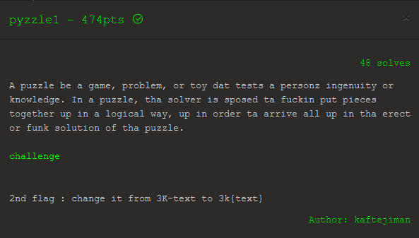

# pyzzle1


The challenge was to reverse [pyzzle](pyzzle):
```python
Module(
    body=[
        SimpleStatementLine(
            body=[
                Import(
                    names=[
                        ImportAlias(
                            name=Name(
                                value='binascii',
                                lpar=[],
                                rpar=[],
                            ),
                            asname=None,
                            comma=MaybeSentinel.DEFAULT,
                        ),
                    ],
                    semicolon=MaybeSentinel.DEFAULT,
                    whitespace_after_import=SimpleWhitespace(
                        value=' ',
                    ),
                ),
            ],
            leading_lines=[],
            trailing_whitespace=TrailingWhitespace(
                whitespace=SimpleWhitespace(
                    value='',
                ),
                comment=None,
                newline=Newline(
                    value=None,
                ),
            ),
        ),
[...]
```
This looks like an [AST](https://en.wikipedia.org/wiki/Abstract_syntax_tree) and the language seems to by python, as `binascii` is a python module. 

There is a default python module for generating AST's, but it does not preserve whitespace and comments. So I did some research and found that the AST was very likely generated with [LibCST](https://libcst.readthedocs.io/en/latest/index.html). 

Unfortunately I didn't find a way for it to read AST's from a file and therefore had to reverse it manually:
```python
import binascii

plaintext = "REDACTED"

def exor(a, b):
    temp = ""
    
    for i in range(n):
        if a[i] == b[i]:
            temp += "0"
        else:
            temp += "1"
    
    return temp
    
def BinaryToDecimal(binary):
    string = int(binary, 2)
    return string 
    
    
# encryption 
PT_Ascii = [ord(x) for x in plaintext]
PT_Bin = [format(y, "08b") for y in PT_Ascii]
PT_Bin = "".join(PT_Bin)
print(PT_Bin)
n = 26936
K1 = "010000001110110[...]"
K2 = "000101101101100[...]"
L1 = PT_Bin[0:n]
R1 = PT_Bin[n:]
f1 = exor(R1, K1)
R2 = exor(f1, L1)
L2 = R1
f2 = exor(R2, K2)
R3 = exor(f2, L2)
L3 = R2
R3 = "01100101000001[...]"
L3 = "01000110111011[...]"
cipher = L3 + R3


# decryption (redacted)
plaintext = L6 + R6 
plaintext = int(plaintext, 2)
plaintext = binascii.unhexlify("%x" % plaintext)
print(plaintext)
```
The Goal was to find the `REDACTED` plaintext, but the decryption algorithm was also redacted. Fortunately the encryption algorithm only uses XOR, which is easily reversible if you know 2 of the 3 variables:
```
a = b XOR c
b = a XOR c
```
To get the plaintext I had to find `L1` and `R1`. The first step was getting `f2` as I already knew 2 of the 3 variables:
```python
R2 = L3
f2 = exor(R2, K2)
```
This then allowed me to retrieve `R1` via `L2`:
```python
# R3 = f2 XOR L2 -> L2 = f2 XOR R3 
L2 = exor(f2, R3)
R1 = L2
```
Now I only needed `L1`, which was dependent on `f1`:
```python
# f1 = R1 XOR K1
f1 = exor(R1, K1)
# R2 = f1 XOR L1 -> L1 = f1 XOR R2 
L1 = exor(f1, R2)
```
Then I used the `binascii` module to decode it to hex:
```python
plaintext = int(plaintext, 2)
plaintext = binascii.unhexlify("%x" % plaintext)
print(plaintext)
```
```
3333443332393435205[...]3435203130350a454e440a0a454f460a
```
Converting this to ASCII gave me the flag and the code for `pyzzle2`.
```
33D32945 STP File, STP Format Version 1.0
SECTION Comment
Name "3k{almost_done_shizzle_up_my_nizzle}"
END

SECTION Graph
Nodes 144
Edges 116
E 1 2 1
E 2 3 1
E 3 5 1
[...]
```
You can see the entire code I used to solve the challenge [here](pyzzle.py).
